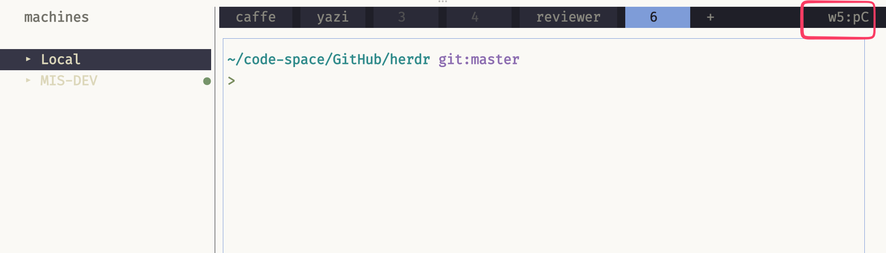

# Herdr Tab Tips

[中文说明](README.zh-CN.md)

Shows the active pane in the tab bar, labels unlabeled panes, and copies the active pane id with `prefix+y`.

`tab_bar_right` needs the plugin source directory (`plugin_root`), not the `config:` path from `herdr plugin list`.



## GitHub

```bash
herdr plugin install elonnzhang/herdr-plugin-tab-tips --yes
herdr plugin list --plugin local.herdr-plugin-tab-tips --json
```

Copy `plugin_root` from the JSON. Merge `config.toml.example` into `~/.config/herdr/config.toml`, replacing `/path/to/herdr-plugin-tab-tips` with that path, then:

```bash
herdr server reload-config
```

## Local

```bash
herdr plugin link /path/to/herdr-plugin-tab-tips
```

Merge `config.toml.example` into `~/.config/herdr/config.toml`, replacing `/path/to/herdr-plugin-tab-tips` with the checkout path, then:

```bash
herdr server reload-config
```

## Config

```toml
[ui]
pane_borders = "always"
pane_outer_borders = true
tab_bar_right = [
  { type = "command", command = "python3 /path/to/herdr-plugin-tab-tips/plugin.py status", interval_seconds = 1, timeout_seconds = 2 },
]
tab_bar_right_separator = " · "

[[keys.command]]
key = "prefix+y"
type = "plugin_action"
command = "local.herdr-plugin-tab-tips.copy-pane-id"
description = "copy active pane ID"
```

Default prefix is `ctrl+b`. Existing pane labels are left unchanged.
